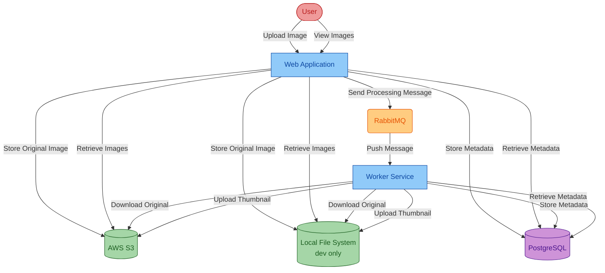

# Assets Manager
Sample project for migration tool code remediation that manages assets in cloud storage.

## Data Flow Chart



## Run Locally

**Prerequisites**: JDK, Docker

Run the following commands to start the apps locally. This will:
* Use local file system instead of S3 to store the image
* Launch RabbitMQ and PostgreSQL using Docker

Windows:

```batch
cd assets-manager
scripts\start.cmd
```

Linux:

```sh
cd assets-manager
scripts/start.sh
```

To stop, run `stop.cmd` or `stop.sh` in the `scripts` directory.